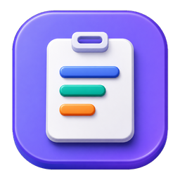
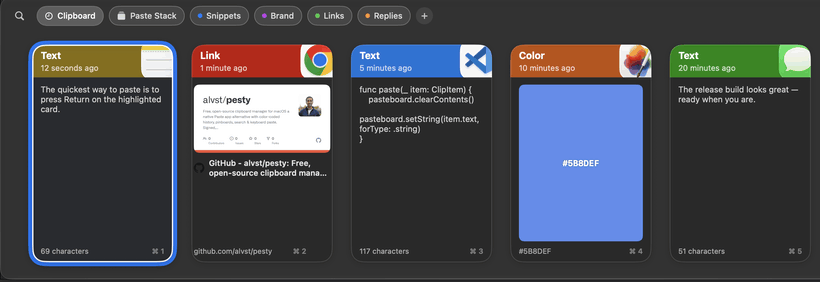

<div align="center">



# Pesty

**A fast, native clipboard library for Mac, with a companion app for iPhone and iPad.**

[](LICENSE)


[Features](#features) · [iPhone and iPad](#iphone-and-ipad-companion) · [Build from source](#build-from-source) · [Extensions](EXTENSIONS.md)



<sub>This is an independently maintained fork of <a href="https://github.com/momenbasel/pesty">momenbasel/pesty</a>.</sub>

</div>

## What is Pesty?

Pesty remembers what you copy and makes it available from a keyboard-first strip at the bottom of your Mac's screen. Press `⌃⌘V`, find a clip, and paste it back into the app you were using. Pinboards keep important clips around, Paste Stacks turn a group of clips into a reusable sequence, and the iPhone/iPad companion carries the library to your other Apple devices.

The project is written in Swift and SwiftUI with no third-party runtime dependencies. Clipboard content stays in local Pesty storage or in the Apple sync option you explicitly enable.

## Project status

| Component | Requirement | Status |
| --- | --- | --- |
| Mac app | macOS 14+ | Active and buildable from `main` |
| iPhone/iPad companion | iOS/iPadOS 17+ | Implemented in `iOSApp/` and under development for the 2.5 release |
| Home Screen widget | iOS/iPadOS 17+ | Included with the companion project |
| Share extension | iOS/iPadOS 17+ | Included with the companion project |

The repository is an active development tree. A feature being present in source does not necessarily mean a signed public release has shipped yet.

## Features

### Native Mac clipboard workflow

- **Slide-up Paste Bar** — a fast, full-width strip on the active display, plus an optional menu-bar control.
- **Six clip types** — plain text, rich text, links, images, files, and colors, with source-app details and native previews.
- **Keyboard-first navigation** — type-to-search, arrow-key navigation, configurable global shortcuts, numbered Quick Paste, section switching, and shortcuts for the first nine Pinboards.
- **Direct paste or copy** — paste into the previous app with Accessibility permission, or copy to the clipboard for a manual paste in sandboxed builds.
- **Multiple paste formats** — use the original representation, plain text, cleaned formatting, or Markdown.
- **Fast editing and creation** — create text clips, edit rich text, rename cards, use Apple Writing Tools where available, and duplicate clips.
- **Selection and bulk actions** — Shift/Command multi-selection, Select All, combined copy, bulk deletion, and Pinboard actions.
- **Five-minute Undo** — recover deleted clips and Pinboards, or hold Option when deleting to remove them immediately.

### Preview, appearance, and sharing

- **Paste-style cards** — app icons, custom titles, type labels, timestamps, character or file counts, and quick-paste numbers.
- **Adaptive colors** — stable colors derived from the source app, a fixed Classic palette, or a user-selected accent theme.
- **Quick Look and inline previews** — inspect text, rich text, links, images, and files without leaving the Paste Bar.
- **Preview actions** — open content in a chosen app, save a lossless copy, or use the macOS share sheet.
- **Drag and drop** — drag clips out to other apps, into Pinboards, or within a Pinboard to reorder them.
- **Responsive layout** — horizontal mouse-wheel support, configurable card and bar sizing, selectable clip alignment, and native Liquid Glass on macOS 26.
- **Custom source icons** — assign separate Light and Dark icons to recognized applications.

### Pinboards and Paste Stacks

- **Pinboards** — create named, color-coded collections whose clips do not expire with normal history retention.
- **Flexible organization** — rename, recolor, reorder, pin clips to the top, drag clips between contexts, and jump to Pinboards 1–9 with `⌘⌥1`–`⌘⌥9` while the bar is open.
- **Paste Stacks** — collect clips copied in any app, reorder the queue, choose its paste direction, paste through it one item at a time, and keep or re-add completed entries.
- **Reusable stacks** — rename saved stacks, return to previous stacks, or save a stack as a Pinboard.

### Search, retention, and import

- **Instant search** — search History, the current Pinboard, and Paste Stacks as you type; enabled extensions can contribute private, local search keywords.
- **Retention controls** — keep a chosen number of clips or retain them for a selected period, with the current on-disk library size shown in Settings.
- **Paste library import** — import supported history, timestamps, source apps, images, and Pinboards from an installed Paste database without modifying it. Existing clips are de-duplicated.
- **Manual Pesty import** — the companion can import a Mac `store.json` library as a one-time migration.

### Sync and privacy

- **Two Mac sync paths** — direct builds can sync Macs through iCloud Drive; sandboxed Mac builds use private CloudKit records.
- **Companion sync** — the sandboxed Mac target and iPhone/iPad companion share the private CloudKit record model used for 2.5 development. The direct-download Mac build does not sync with iOS.
- **Sensitive clipboard protection** — concealed, confidential, transient, and app-generated pasteboard markers can be excluded.
- **Per-app exclusions** — prevent selected apps, including password managers, from entering clipboard history.
- **Capture controls** — pause Pesty, optionally ignore changes made while the Mac sleeps, and control whether the bar appears during screen sharing.
- **Network control** — link metadata fetching can be disabled. The core clipboard workflow does not require a third-party service.

### JavaScript extensions

Pesty includes a deliberately narrow, Mac-only JavaScript extension system. Extensions can:

- add badges, subtitles, icons, colors, titles, and labels to clip cards;
- contribute searchable keywords and suggest an existing Pinboard;
- provide explicit transformed-paste actions;
- add bounded safe actions such as transformed copy or Reveal in Finder; and
- expose typed settings in Pesty's Extensions pane.

Extensions receive only the current clip's bounded text and type, plus their own settings. They have no network or file APIs, run with strict time limits, and are automatically disabled after a timeout or repeated failures. Pesty includes Token Count and JSON Detector examples.

See the [extension overview](EXTENSIONS.md) and [authoring cookbook](EXTENSION-AUTHORING.md) for the full API and runnable examples.

## iPhone and iPad companion

The native iOS/iPadOS companion in `iOSApp/` is development source for the 2.5 release line. It is not required to build or use the Mac app.

Its implemented features include:

- a searchable, type-filterable clip library with rich previews;
- color-coded Pinboards and clip detail views;
- creation of text, rich-text, link, image, and color clips;
- explicit copy-back to the iOS clipboard, including plain-text copies;
- photo import, the system share sheet, and a Pesty Share extension for saving content from other apps;
- a Home Screen widget for recent clips with deep links to a clip, search, and new-clip creation;
- private CloudKit sync for clips, Pinboards, images, rich text, offline changes, edits, ordering, conflicts, and deletions;
- five-minute local deletion Undo before a hard delete is synced; and
- owner-protected local files plus a one-time Mac `store.json` importer.

The iOS simulator intentionally uses a local-only library. CloudKit, push delivery, and cross-device behavior require signed physical devices and a correctly provisioned iCloud container. See [iOSApp/README.md](iOSApp/README.md) for setup and release boundaries.

## Install and first run

There is not currently a prebuilt download attached to this fork. Build the app from source using the instructions below.

On first launch:

1. Press `⌃⌘V` to show the Paste Bar.
2. Copy something in any app, select it in Pesty, and press Return.
3. For direct pasting, grant Pesty access in **System Settings → Privacy & Security → Accessibility** when macOS asks. Without that permission, Pesty can still copy the selected clip for you to paste manually.

## Mac keyboard shortcuts

Defaults can be changed in **Settings → Shortcuts** where noted.

| Shortcut | Action |
| --- | --- |
| `⌃⌘V` | Show or hide the Paste Bar (configurable) |
| `⌃⌥⌘V` | Paste the next Paste Stack item (configurable) |
| Type | Search the current section |
| `←` `→` `↑` `↓` | Move the selection |
| `⇧` + arrows | Extend the selection |
| `⌘←` / `⌘→` | Move between History, Pinboards, and Paste Stack sections |
| `return` | Paste the selected clip |
| `space` | Open or close the selected clip's preview |
| `⌘C` | Copy the selected clip or combined multi-selection |
| `⌘1`–`⌘9` | Quick Paste clips 1–9 (modifier configurable) |
| `⌘⇧1`–`⌘⇧9` | Quick Paste clips 1–9 as plain text with the default modifiers |
| `⌘⌥1`–`⌘⌥9` | Open Pinboards 1–9 while the bar is visible |
| `⌘A` | Select every visible clip |
| `delete` | Delete the selection or remove a Paste Stack entry |
| `⌥delete` | Delete immediately without the Undo window |
| `⌘Z` | Undo the most recent deletion |
| `⌘N` | Create a text clip |
| `⌘⇧P` | Pause or resume clipboard capture |
| `esc` | Clear search, cancel a drag, or close the bar |
| `⌘S` in Preview | Save a copy of the previewed clip |
| `⌘O` in Preview | Open the previewed content in its configured app |

## Build from source

### Mac app

The Mac app requires macOS 14 or later and a Swift 6 toolchain. The Xcode projects are pinned to Xcode 26.3.

```bash
git clone https://github.com/alvst/pesty.git
cd pesty

# Run directly with Swift Package Manager
swift run Pesty

# Or assemble a universal Apple Silicon + Intel app bundle
VERSION=2.0.0 BUILD=1 ./scripts/build_app.sh
open packaging/Pesty.app
```

Run the Mac test suite with:

```bash
swift test
```

To produce a signed and notarized DMG, provide a Developer ID certificate and App Store Connect API key:

```bash
SIGN_IDENTITY="Developer ID Application: Your Name (TEAMID)" \
ASC_KEY="$HOME/.appstoreconnect/private_keys/AuthKey_XXXX.p8" \
ASC_KEY_ID="XXXX" ASC_ISSUER="<issuer-uuid>" \
./scripts/release_build.sh
```

### iPhone and iPad companion

Signing is configured per checkout so contributor team IDs are not committed. Start with the example configuration, add your Apple Developer team ID, and regenerate or open the project:

```bash
cd iOSApp
cp Config/Signing.local.xcconfig.example Config/Signing.local.xcconfig
# Edit Config/Signing.local.xcconfig and replace YOUR_TEAM_ID.
xcodegen generate --spec project.yml
open Pesty.xcodeproj
```

The companion, widget, and share extension use separate App IDs and the private `iCloud.com.alvst.pesty` container. Full provisioning instructions and the simulator test command are in [iOSApp/README.md](iOSApp/README.md).

## Project structure

```text
Sources/Pesty/                 Mac app
  AppController.swift          app lifecycle, commands, paste handoff
  Extensions/                  JavaScript extension host and catalog
  Models/                      clips, clip types, and Pinboards
  Monitor/                     clipboard capture and paste service
  Settings/                    preferences and shortcut configuration
  Store/                       history, selection, Paste Stacks, import
  Sync/                        CloudKit schema, codec, and MAS sync
  UI/                          Paste Bar, cards, previews, editor, stacks
  Util/                        previews, formatting, icons, colors, export
Tests/PestyTests/              Mac unit and behavior tests
iOSApp/Pesty/                  iPhone/iPad companion app
iOSApp/PestyWidget/            recent-clips Home Screen widget
iOSApp/PestyShareExtension/    iOS/iPadOS Share extension
scripts/                       build, signing, icon, and release scripts
packaging/                     Mac app metadata, entitlements, and icon
docs/                          project website and media
```

## FAQ

**Is Pesty free?**

Yes. Pesty is available under the MIT License.

**How does this fork relate to the original Pesty project?**

This repository is independently maintained and continues to use Pesty's app, executable, and package names. The original project is available at [momenbasel/pesty](https://github.com/momenbasel/pesty).

**Can I import my Paste library?**

Yes. Open **Settings → General → Import from Paste…** and choose the Paste database. Pesty imports supported history payloads and Pinboards without modifying the original library, and skips duplicates.

**How does sync work?**

Direct Mac builds can sync with other Macs through iCloud Drive. Sandboxed Mac builds use private CloudKit records and are the path intended to interoperate with the iPhone/iPad companion. Sync is opt-in.

**Does Pesty upload my clipboard to a third party?**

No. Content is stored locally unless you enable an Apple iCloud sync option. Optional link previews may contact the linked website or metadata provider, and can be disabled in Settings.

**What Mac does it support?**

macOS 14 Sonoma or later on Apple Silicon or Intel.

## Contributing

Contributions are welcome. Read [CONTRIBUTING.md](CONTRIBUTING.md) before opening a pull request. Visual changes should include before-and-after screenshots.

## License

[MIT](LICENSE) © 2026 Moamen Basel.

## Disclaimer

This repository is an independently maintained fork of [momenbasel/pesty](https://github.com/momenbasel/pesty), originally created by Moamen Basel. Neither project is affiliated with, endorsed by, or connected to Paste or its makers. Product names and trademarks belong to their respective owners.
